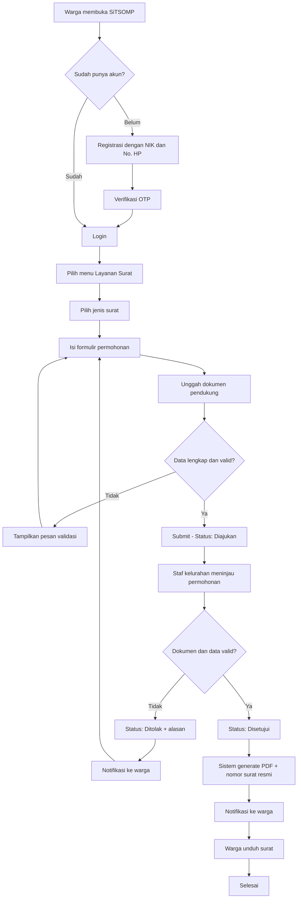
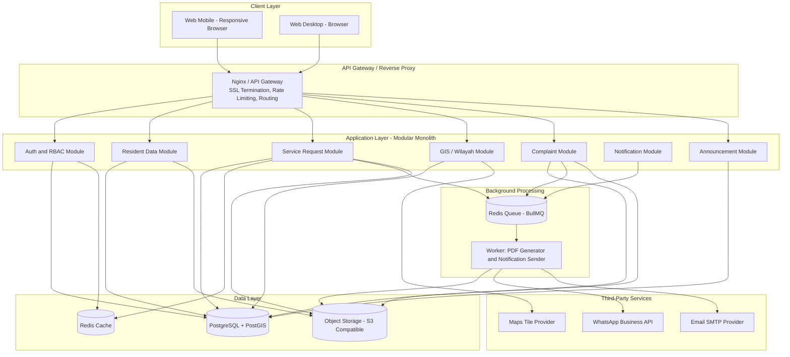
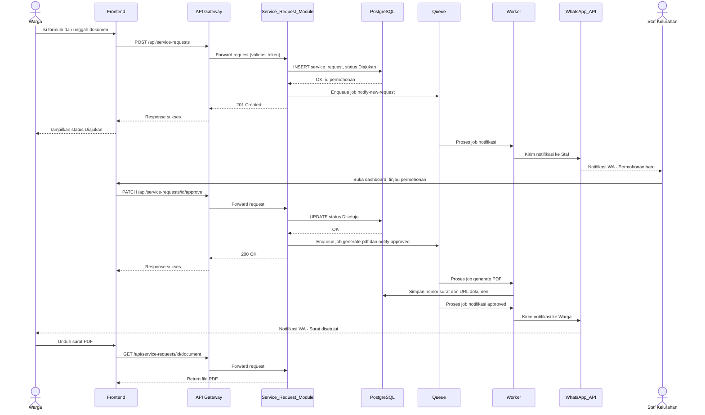
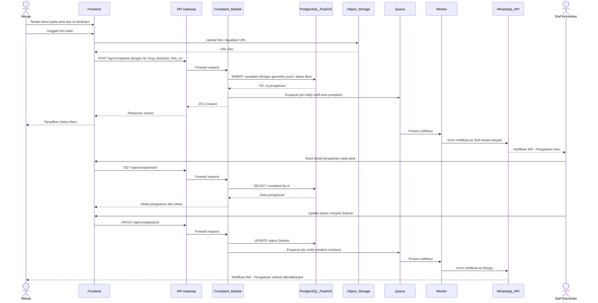
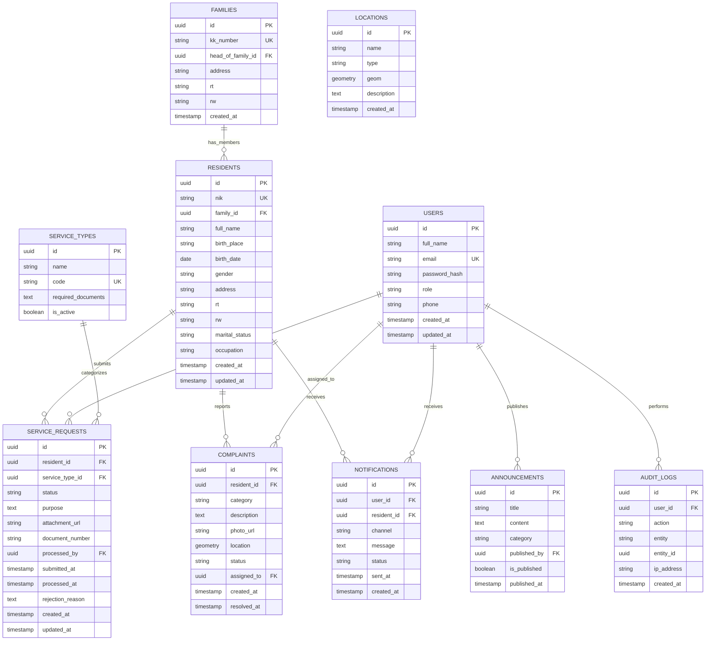

# Product Requirement Document (PRD)
## SiTSOMP — Sistem Informasi Kelurahan Tiro Sompe

| Metadata | Detail |
|---|---|
| Nama Produk | SiTSOMP (Sistem Informasi Kelurahan Tiro Sompe) |
| Versi Dokumen | 1.0 |
| Tanggal | 14 Agustus 2026 |
| Status | Draft untuk Review |
| Disusun oleh | Product & Engineering Team |
| Target Instansi | Kantor Kelurahan Tiro Sompe, Kecamatan Bacukiki Barat, Kota Parepare, Provinsi Sulawesi Selatan |

---

## 1. Overview

### 1.1 Executive Summary

SiTSOMP adalah platform digital berbasis web yang dirancang untuk Kantor Kelurahan Tiro Sompe guna mendigitalisasi tiga pilar utama operasional kelurahan: **(1) pengelolaan data kependudukan**, **(2) pelayanan administrasi publik**, dan **(3) penyediaan informasi lokasi/wilayah**. Sistem ini menggantikan proses manual berbasis kertas dan spreadsheet dengan platform terpusat yang dapat diakses melalui web mobile maupun web desktop, baik oleh aparat kelurahan maupun masyarakat umum.

Dengan SiTSOMP, warga dapat mengajukan permohonan surat administrasi secara daring tanpa harus datang langsung ke kantor kelurahan, melacak status permohonan secara real-time, serta mengakses peta interaktif wilayah Tiro Sompe untuk menemukan batas RT/RW dan fasilitas umum. Di sisi lain, aparat kelurahan memperoleh satu sumber data (*single source of truth*) untuk data warga, dashboard statistik, dan alat kerja untuk memproses layanan secara lebih cepat dan terlacak (*auditable*).

### 1.2 Problem Statement & Goals

**Problem Statement**

| # | Masalah | Dampak |
|---|---|---|
| P1 | Data kependudukan dikelola manual (dokumen fisik/spreadsheet terpisah per RT/RW) | Rawan duplikasi data, sulit dicari, tidak konsisten, rentan hilang/rusak |
| P2 | Warga harus datang langsung ke kantor kelurahan untuk mengurus surat administrasi | Antre lama, keterbatasan jam layanan, tidak ada transparansi status permohonan |
| P3 | Tidak ada sumber data terpusat mengenai batas wilayah, fasilitas umum, dan sebaran RT/RW | Menyulitkan warga baru, layanan darurat, dan perencanaan pembangunan kelurahan |
| P4 | Minimnya visibilitas data agregat (statistik kependudukan, volume layanan) | Lurah dan aparat kesulitan mengambil keputusan berbasis data |

**Goals & Key Success Metrics (KPI)**

*Catatan: target di bawah ini merupakan usulan target kinerja (goal), bukan data hasil pengukuran aktual — perlu dikalibrasi ulang bersama pihak Kelurahan setelah baseline awal tersedia.*

| KPI | Target | Periode Pengukuran |
|---|---|---|
| Rata-rata waktu pemrosesan permohonan surat | ≤ 1 hari kerja (T+1) untuk 80% permohonan | 6 bulan pasca-peluncuran |
| Digitalisasi data kependudukan aktif | ≥ 90% warga terdaftar dalam sistem | 3 bulan pertama |
| Proporsi permohonan diajukan online (bukan datang langsung) | ≥ 70% dari total permohonan | 6 bulan pasca-peluncuran |
| Ketersediaan sistem (uptime) | ≥ 99.5% per bulan | Berkelanjutan |
| Cakupan pemetaan wilayah digital (RT/RW) | 100% batas RT/RW terpetakan | 2 bulan pertama |
| Kepuasan pengguna (CSAT) layanan online | ≥ 4.0 / 5.0 | Survei triwulanan |

### 1.3 Scope & Out-of-Scope

**In Scope (Versi 1 / MVP)**
- Modul Autentikasi & Manajemen Peran Pengguna (RBAC)
- Modul Manajemen Data Kependudukan & Kartu Keluarga (KK)
- Modul Layanan Administrasi Surat Online (pengajuan → verifikasi → approval → cetak)
- Modul Peta & Informasi Wilayah (GIS dasar: batas RT/RW, titik fasilitas umum)
- Modul Pengaduan Masyarakat berbasis lokasi
- Modul Portal Informasi & Pengumuman Publik
- Modul Dashboard & Statistik untuk aparat kelurahan
- Modul Notifikasi (WhatsApp/Email)

**Out-of-Scope (Versi 1)**
- Aplikasi mobile native iOS/Android — platform V1 adalah web responsif (mobile & desktop) sesuai spesifikasi produk
- Payment gateway / retribusi digital — belum ada kebutuhan transaksi finansial pada V1
- Integrasi langsung dua-arah dengan sistem Dukcapil/SIAK pusat — memerlukan kerja sama formal terpisah dengan Kementerian Dalam Negeri, di luar cakupan tim produk
- Dukungan multi-kelurahan/multi-tenant — sistem V1 dirancang khusus untuk satu instansi (Kelurahan Tiro Sompe)
- Live chat real-time antara warga dan staf — cukup diwakili oleh notifikasi status dan riwayat permohonan

---

## 2. Requirements

### 2.1 Functional Requirements

**Modul FR-1: Autentikasi & Manajemen Pengguna**
- FR-1.1 Sistem harus menyediakan login untuk staf kelurahan menggunakan email dan password.
- FR-1.2 Sistem harus menyediakan registrasi dan login warga menggunakan NIK dan nomor HP/email, diverifikasi melalui OTP.
- FR-1.3 Sistem harus menerapkan Role-Based Access Control (RBAC) dengan minimal 4 peran: `super_admin` (Lurah), `admin` (Sekretaris Kelurahan), `operator` (Staf Layanan), `warga`.
- FR-1.4 Sistem harus menyediakan mekanisme reset password melalui email/OTP.
- FR-1.5 Sistem harus mencatat log setiap aktivitas login/logout untuk audit keamanan.

**Modul FR-2: Manajemen Data Kependudukan**
- FR-2.1 Staf harus dapat melakukan CRUD data warga (nama, NIK, tempat/tanggal lahir, alamat, RT/RW, dst).
- FR-2.2 Sistem harus memvalidasi NIK unik (16 digit numerik, tidak boleh duplikat).
- FR-2.3 Sistem harus mengelompokkan data warga ke dalam entitas Kartu Keluarga (KK).
- FR-2.4 Sistem harus menyediakan pencarian dan filter data warga berdasarkan nama, NIK, dan RT/RW.
- FR-2.5 Sistem harus mendukung impor data massal (bulk import) dari file Excel/CSV untuk migrasi data awal.
- FR-2.6 Sistem harus menyediakan ekspor data (PDF/Excel) untuk kebutuhan pelaporan ke kecamatan.

**Modul FR-3: Layanan Administrasi Surat**
- FR-3.1 Warga harus dapat mengajukan permohonan surat secara online untuk jenis layanan yang tersedia di Kelurahan Tiro Sompe, termasuk namun tidak terbatas pada: Surat Keterangan Domisili, Surat Pengantar NPWP, Surat Keterangan Kelakuan Baik, Surat Pindah Keluar, Surat Keterangan Tidak Mampu (SKTM), Surat Keterangan Usaha (SKU), Surat Keterangan Usaha Mikro, Surat Pernyataan Miskin, dan Surat Domisili Sementara.
- FR-3.2 Warga harus dapat mengunggah dokumen pendukung (scan KTP/KK, dsb) dalam format PDF/JPG/PNG maksimal 5MB per file.
- FR-3.3 Sistem harus menampilkan status permohonan secara real-time: `Diajukan` → `Diverifikasi` → `Disetujui`/`Ditolak` → `Selesai`.
- FR-3.4 Staf harus dapat meninjau, menyetujui, atau menolak (disertai alasan wajib) permohonan melalui dashboard admin.
- FR-3.5 Sistem harus otomatis men-generate dokumen surat dalam format PDF dengan nomor surat resmi dan QR code verifikasi keaslian saat permohonan disetujui.
- FR-3.6 Warga harus dapat mengunduh surat yang telah disetujui.
- FR-3.7 Admin harus dapat mengkonfigurasi template surat dan daftar dokumen persyaratan per jenis layanan.

**Modul FR-4: Peta & Informasi Wilayah (GIS)**
- FR-4.1 Sistem harus menampilkan peta interaktif wilayah Kelurahan Tiro Sompe beserta batas RT/RW.
- FR-4.2 Sistem harus menampilkan titik lokasi fasilitas umum (kantor kelurahan, sekolah, puskesmas, tempat ibadah, dst).
- FR-4.3 Admin harus dapat menambah, mengedit, dan menghapus titik lokasi maupun poligon batas wilayah.
- FR-4.4 Warga harus dapat mencari lokasi/fasilitas melalui kolom pencarian pada peta.
- FR-4.5 Sistem harus menyimpan data geospasial (titik/poligon) menggunakan format standar (GeoJSON/WKT).

**Modul FR-5: Pengaduan Masyarakat**
- FR-5.1 Warga harus dapat mengajukan laporan/pengaduan dengan menandai lokasi kejadian pada peta.
- FR-5.2 Warga harus dapat melampirkan foto sebagai bukti pengaduan.
- FR-5.3 Staf harus dapat mengubah status pengaduan (`Baru` → `Diproses` → `Selesai`/`Ditolak`) dan mencatat tindak lanjut.
- FR-5.4 Sistem harus menampilkan riwayat status pengaduan kepada warga pelapor.

**Modul FR-6: Portal Informasi & Pengumuman**
- FR-6.1 Admin harus dapat mempublikasikan pengumuman/berita ke halaman publik.
- FR-6.2 Sistem harus menampilkan profil dan monografi kelurahan (visi-misi, struktur organisasi, statistik dasar).
- FR-6.3 Sistem harus menampilkan jadwal dan jam pelayanan kelurahan.

**Modul FR-7: Dashboard & Statistik**
- FR-7.1 Sistem harus menampilkan ringkasan statistik kependudukan (jumlah warga per RT/RW, jenis kelamin, kelompok usia) dalam bentuk grafik.
- FR-7.2 Sistem harus menampilkan statistik jumlah dan status permohonan layanan surat per periode.
- FR-7.3 Sistem harus menyediakan filter laporan berdasarkan rentang tanggal dan jenis layanan.

**Modul FR-8: Notifikasi**
- FR-8.1 Sistem harus mengirimkan notifikasi (WhatsApp/Email) ke warga saat status permohonan surat atau pengaduan berubah.
- FR-8.2 Sistem harus mengirimkan notifikasi ke staf saat ada permohonan atau pengaduan baru masuk.

### 2.2 Non-Functional Requirements

**Performance**
- NFR-1: Waktu respons API untuk operasi baca (GET) harus < 500ms pada persentil ke-95 (p95) di bawah beban ≤100 concurrent users.
- NFR-2: First Contentful Paint (FCP) halaman harus < 3 detik pada koneksi 4G.
- NFR-3: Proses generate PDF surat harus selesai dalam < 5 detik sejak permohonan disetujui.

**Security**
- NFR-4: Seluruh komunikasi klien-server harus dienkripsi menggunakan HTTPS/TLS 1.2 atau lebih tinggi.
- NFR-5: Password harus disimpan menggunakan algoritma hashing satu arah (bcrypt/argon2); tidak pernah disimpan dalam bentuk plain text.
- NFR-6: Data pribadi warga (NIK, alamat, dst) harus dienkripsi saat disimpan (*encryption at rest*) dan akses dibatasi berdasarkan RBAC, sejalan dengan prinsip perlindungan data pribadi pada UU No. 27 Tahun 2022 tentang Pelindungan Data Pribadi.
- NFR-7: Sistem harus menerapkan proteksi terhadap kerentanan umum (SQL Injection, XSS, CSRF) melalui validasi input dan parameterized query di seluruh endpoint.
- NFR-8: Sistem harus mencatat audit log untuk setiap operasi create/update/delete pada data sensitif (data warga, permohonan surat).
- NFR-9: Endpoint publik (login, registrasi, OTP) harus menerapkan rate limiting untuk mencegah brute-force dan penyalahgunaan.

**Scalability**
- NFR-10: Arsitektur backend harus stateless agar mendukung horizontal scaling.
- NFR-11: Database harus dirancang untuk menampung minimal 50.000 record data warga dengan proyeksi pertumbuhan 5 tahun tanpa penurunan performa signifikan.

**Availability/SLA**
- NFR-12: Target uptime sistem 99.5% per bulan (maksimal downtime ±3.6 jam/bulan di luar maintenance terjadwal).
- NFR-13: Backup database otomatis harian dengan retensi minimal 30 hari.
- NFR-14: Recovery Time Objective (RTO) ≤ 4 jam; Recovery Point Objective (RPO) ≤ 24 jam.

**Usability & Compliance**
- NFR-15: Antarmuka harus responsif (mobile-first) dan berfungsi baik pada lebar layar ≥360px.
- NFR-16: Bahasa antarmuka utama adalah Bahasa Indonesia.
- NFR-17: Sebagai sistem instansi pemerintah, arsitektur dan tata kelola data harus selaras dengan prinsip Sistem Pemerintahan Berbasis Elektronik (SPBE) sesuai Peraturan Presiden No. 95 Tahun 2018 — mencakup aspek keamanan, interoperabilitas, dan integrasi layanan.

---

## 3. Core Feature

Setiap fitur diberi prioritas menggunakan kerangka **MoSCoW** (Must have / Should have / Could have / Won't have) dan kriteria penerimaan format **Given-When-Then**.

### 3.1 Pengajuan Surat Online — `Must Have`
Warga mengajukan permohonan surat administrasi secara mandiri melalui formulir digital, tanpa perlu datang ke kantor kelurahan.

**AC1**
- **Given** warga telah login dan memilih jenis layanan "Surat Keterangan Domisili"
- **When** warga mengisi seluruh field wajib, mengunggah dokumen pendukung, dan menekan tombol "Ajukan"
- **Then** sistem menyimpan permohonan dengan status `Diajukan`, memberikan nomor tiket permohonan, dan mengirim notifikasi konfirmasi ke warga

**AC2**
- **Given** warga belum mengisi field wajib (mis. keperluan surat)
- **When** warga menekan tombol "Ajukan"
- **Then** sistem menampilkan pesan validasi pada field terkait dan tidak menyimpan permohonan

### 3.2 Verifikasi & Approval Surat oleh Staf — `Must Have`
Staf kelurahan meninjau kelengkapan dan validitas permohonan sebelum menerbitkan surat resmi.

**AC1**
- **Given** staf melihat daftar permohonan berstatus `Diajukan`
- **When** staf menekan "Setujui" pada satu permohonan
- **Then** status berubah menjadi `Disetujui`, sistem men-generate PDF surat dengan nomor resmi dan QR code, serta mengirim notifikasi ke warga

**AC2**
- **Given** staf menemukan dokumen pendukung tidak valid atau tidak lengkap
- **When** staf menekan "Tolak" dan mengisi alasan penolakan
- **Then** status berubah menjadi `Ditolak`, alasan ditampilkan ke warga, dan warga dapat mengajukan ulang

### 3.3 Manajemen Data Kependudukan — `Must Have`
Staf mengelola data warga dan Kartu Keluarga sebagai sumber data tunggal (*single source of truth*).

**AC1**
- **Given** admin berada di halaman "Data Warga" dan menambahkan warga baru
- **When** NIK yang diinput sudah terdaftar di sistem
- **Then** sistem menolak penyimpanan dan menampilkan pesan "NIK sudah terdaftar"

### 3.4 Peta Interaktif Wilayah — `Must Have`
Memenuhi kebutuhan inti "Penyediaan Lokasi Wilayah Tiro Sompe" melalui peta digital yang dapat diakses publik.

**AC1**
- **Given** warga membuka halaman "Peta Wilayah"
- **When** warga mencari "Puskesmas" pada kolom pencarian
- **Then** sistem menampilkan titik lokasi Puskesmas pada peta beserta informasi singkat (nama, alamat, RT/RW)

### 3.5 Autentikasi & Kontrol Akses (RBAC) — `Must Have`
Memastikan setiap peran hanya dapat mengakses fitur sesuai kewenangannya.

**AC1**
- **Given** pengguna dengan role `warga` telah login
- **When** pengguna mencoba mengakses URL halaman "Manajemen Data Kependudukan"
- **Then** sistem menampilkan halaman "Akses Ditolak" (HTTP 403) dan mencatatnya pada audit log

### 3.6 Pengaduan Masyarakat Berbasis Lokasi — `Should Have`
Warga melaporkan permasalahan lingkungan (jalan rusak, lampu mati, dst) lengkap dengan titik lokasi.

**AC1**
- **Given** warga ingin melaporkan jalan rusak
- **When** warga menandai titik lokasi pada peta, mengisi deskripsi, dan mengunggah foto bukti
- **Then** sistem menyimpan laporan dengan koordinat geospasial dan status `Baru`, lalu meneruskan notifikasi ke staf terkait

### 3.7 Notifikasi Status via WhatsApp/Email — `Should Have`
Warga mendapat kabar status permohonan tanpa perlu mengecek sistem secara manual.

**AC1**
- **Given** status permohonan surat warga berubah dari `Diajukan` menjadi `Disetujui`
- **When** perubahan status tersimpan di database
- **Then** sistem mengirimkan pesan WhatsApp atau email otomatis ke kontak terdaftar warga dalam waktu < 1 menit

### 3.8 Portal Informasi & Pengumuman Publik — `Should Have`
Kanal resmi kelurahan untuk menyampaikan informasi kepada warga tanpa perlu login.

**AC1**
- **Given** admin mempublikasikan pengumuman baru dengan status "Publish"
- **When** pengumuman disimpan
- **Then** pengumuman langsung tampil di halaman publik tanpa memerlukan autentikasi

### 3.9 Dashboard Statistik Kependudukan & Layanan — `Should Have`
Memberi visibilitas data agregat bagi Lurah dan aparat untuk pengambilan keputusan.

**AC1**
- **Given** admin membuka halaman Dashboard
- **When** admin memilih rentang tanggal tertentu
- **Then** sistem menampilkan grafik jumlah dan status permohonan surat per RT/RW dalam rentang tersebut

### 3.10 Impor Data Massal (Bulk Import) — `Could Have`
Mempercepat migrasi data kependudukan awal dari sumber existing (spreadsheet kelurahan).

**AC1**
- **Given** admin mengunggah file Excel data warga sesuai template yang disediakan
- **When** admin menekan "Import"
- **Then** sistem memvalidasi setiap baris dan menampilkan ringkasan hasil (jumlah berhasil/gagal beserta alasan kegagalan)

### 3.11 Integrasi Verifikasi NIK ke Dukcapil — `Won't Have (V1)`
Verifikasi otomatis NIK ke database pusat Dukcapil memerlukan kerja sama resmi dan akses API yang berada di luar kewenangan tim produk kelurahan; ditunda ke fase berikutnya.

### 3.12 Pembayaran Retribusi Online — `Won't Have (V1)`
Ditunda hingga terdapat kejelasan regulasi dan kebutuhan retribusi digital di tingkat kelurahan.

---

## 4. User Flow

### 4.1 Happy Path — Pengajuan Surat Online



**Deskripsi Edge Case Utama**

| Edge Case | Penanganan Sistem |
|---|---|
| NIK sudah terdaftar saat registrasi | Sistem menolak registrasi baru dan mengarahkan warga ke halaman login/reset password |
| Ukuran file dokumen melebihi 5MB | Sistem menolak unggahan dan menampilkan batas ukuran maksimum |
| OTP tidak diselesaikan dalam 5 menit | OTP kedaluwarsa; warga harus meminta kode OTP baru |
| Warga mengajukan jenis surat yang sama saat permohonan sebelumnya masih berstatus `Diajukan` | Sistem menampilkan peringatan potensi duplikasi sebelum submit final (tidak memblokir otomatis) |
| Koneksi terputus saat unggah dokumen | Sistem menyimpan draf formulir sementara (auto-save) agar warga tidak perlu mengisi ulang dari awal |
| Staf menolak permohonan tanpa mengisi alasan | Sistem memvalidasi bahwa field alasan penolakan wajib diisi sebelum status dapat diubah menjadi `Ditolak` |

---

## 5. Architecture

### 5.1 High-Level Architecture

Sistem dirancang sebagai **modular monolith** menggunakan pendekatan modul berbasis domain (bukan microservices penuh). Untuk skala satu instansi kelurahan, microservices akan menimbulkan kompleksitas operasional (orkestrasi, observability, deployment) yang tidak sepadan dengan manfaatnya. Batasan antar-modul tetap dijaga tegas agar dapat dipecah menjadi layanan independen di kemudian hari, misalnya bila SiTSOMP diperluas untuk mencakup beberapa kelurahan/kecamatan sekaligus (multi-tenant).



**Penjelasan Layer**

| Layer | Tanggung Jawab |
|---|---|
| Client | Antarmuka web responsif diakses via browser mobile/desktop; dibangun sebagai Progressive Web App (PWA) agar terasa seperti aplikasi native tanpa perlu instalasi dari app store |
| API Gateway | Titik masuk tunggal: SSL termination, rate limiting, routing ke modul, request logging |
| Application (Service Modules) | Logika bisnis per domain (Auth, Kependudukan, Layanan Surat, GIS, Pengaduan, Notifikasi, Pengumuman); dipisah sebagai modul terisolasi dalam satu deployable unit |
| Background Processing | Menjalankan tugas asinkron (generate PDF, kirim notifikasi, proses bulk import) agar request API utama tetap cepat |
| Data Layer | PostgreSQL+PostGIS sebagai primary datastore (termasuk data geospasial); Redis untuk cache & antrean; Object storage untuk file (foto, PDF, scan dokumen) |
| Third-Party | Layanan eksternal: WhatsApp Business API, SMTP email, dan penyedia peta |

### 5.2 Strategi Caching

- Redis digunakan untuk **session/token caching** (termasuk JWT blacklist saat logout).
- Data yang jarang berubah namun sering diakses (daftar jenis layanan, data wilayah/GIS) di-cache dengan TTL 10–30 menit untuk mengurangi beban query database.
- Redis juga menyimpan counter untuk **rate limiting** per-IP/per-user pada endpoint publik.

### 5.3 Queue / Messaging

- **BullMQ** (berbasis Redis) menangani seluruh tugas asinkron: generate PDF surat, pengiriman notifikasi WhatsApp/Email, dan proses bulk import data warga — agar request API tetap responsif.
- Job yang gagal di-retry otomatis (maksimal 3 kali, exponential backoff) sebelum ditandai `failed` dan dieskalasi ke admin melalui dashboard monitoring job.
- Dipilih BullMQ dibanding RabbitMQ/Kafka karena kesederhanaan operasional untuk skala satu kelurahan — tidak memerlukan infrastruktur broker terpisah. Migrasi ke broker yang lebih tangguh dapat dipertimbangkan bila skala berkembang menjadi multi-kelurahan/kecamatan dengan volume tinggi.

### 5.4 Deployment / Infrastructure

- **Containerization**: Docker untuk seluruh komponen (app, worker, reverse proxy).
- **Orkestrasi**: Docker Compose untuk tahap awal (skala satu instansi); migrasi ke Kubernetes hanya dipertimbangkan bila skala meningkat signifikan.
- **CI/CD**: GitHub Actions — otomatisasi build, test, dan deployment ke tiap environment.
- **Environment**: dipisah menjadi Development, Staging, dan Production.
- **Hosting**: cloud provider komersial (mis. DigitalOcean/AWS/GCP) untuk fleksibilitas awal. Karena SiTSOMP merupakan sistem instansi pemerintah, kebijakan hosting perlu dikoordinasikan dengan Dinas Kominfo setempat terkait potensi kewajiban keselarasan dengan Pusat Data Nasional (PDN) sesuai arahan SPBE (Perpres No. 95/2018) — poin ini memerlukan konfirmasi kebijakan daerah, bukan asumsi tim produk.
- **Monitoring**: Sentry untuk error tracking; Prometheus + Grafana (opsional) untuk monitoring infrastruktur dan job queue.

---

## 6. Sequence Diagram

### 6.1 Skenario Kritis 1 — Pengajuan dan Approval Surat Online



### 6.2 Skenario Kritis 2 — Pengaduan Masyarakat Berbasis Lokasi



---

## 7. Database Schema

Desain menggunakan basis data **relasional (PostgreSQL)** dengan ekstensi **PostGIS** untuk kebutuhan data geospasial, mengingat kebutuhan inti sistem terkait penyediaan informasi lokasi/wilayah.

### 7.1 Entity-Relationship Diagram



*Catatan: tabel `LOCATIONS` menyimpan referensi titik/poligon untuk rendering peta (fasilitas umum, batas RT/RW) dan tidak di-JOIN langsung ke `COMPLAINTS` — setiap pengaduan menyimpan koordinatnya sendiri (`location`) karena titik pengaduan bersifat bebas, tidak terikat pada titik referensi yang sudah terdaftar.*

### 7.2 SQL DDL (PostgreSQL + PostGIS)

```sql
-- Ekstensi yang diperlukan
CREATE EXTENSION IF NOT EXISTS "uuid-ossp";
CREATE EXTENSION IF NOT EXISTS postgis;

CREATE TABLE families (
    id UUID PRIMARY KEY DEFAULT uuid_generate_v4(),
    kk_number VARCHAR(20) UNIQUE NOT NULL,
    head_of_family_id UUID, -- FK ke residents.id, ditambahkan via ALTER (menghindari circular dependency saat data awal)
    address TEXT NOT NULL,
    rt VARCHAR(5) NOT NULL,
    rw VARCHAR(5) NOT NULL,
    created_at TIMESTAMPTZ NOT NULL DEFAULT now()
);

CREATE TABLE residents (
    id UUID PRIMARY KEY DEFAULT uuid_generate_v4(),
    nik VARCHAR(16) UNIQUE NOT NULL,
    family_id UUID NOT NULL REFERENCES families(id) ON DELETE RESTRICT,
    full_name VARCHAR(150) NOT NULL,
    birth_place VARCHAR(100),
    birth_date DATE NOT NULL,
    gender VARCHAR(10) NOT NULL CHECK (gender IN ('L', 'P')),
    address TEXT NOT NULL,
    rt VARCHAR(5) NOT NULL,
    rw VARCHAR(5) NOT NULL,
    marital_status VARCHAR(20),
    occupation VARCHAR(100),
    created_at TIMESTAMPTZ NOT NULL DEFAULT now(),
    updated_at TIMESTAMPTZ NOT NULL DEFAULT now()
);

ALTER TABLE families
    ADD CONSTRAINT fk_family_head FOREIGN KEY (head_of_family_id)
    REFERENCES residents(id) ON DELETE SET NULL;

CREATE TABLE users (
    id UUID PRIMARY KEY DEFAULT uuid_generate_v4(),
    full_name VARCHAR(150) NOT NULL,
    email VARCHAR(150) UNIQUE NOT NULL,
    password_hash VARCHAR(255) NOT NULL,
    role VARCHAR(30) NOT NULL CHECK (role IN ('super_admin','admin','operator','warga')),
    phone VARCHAR(20),
    resident_id UUID REFERENCES residents(id) ON DELETE SET NULL,
    created_at TIMESTAMPTZ NOT NULL DEFAULT now(),
    updated_at TIMESTAMPTZ NOT NULL DEFAULT now()
);

CREATE TABLE service_types (
    id UUID PRIMARY KEY DEFAULT uuid_generate_v4(),
    name VARCHAR(100) NOT NULL,
    code VARCHAR(30) UNIQUE NOT NULL,
    required_documents TEXT,
    is_active BOOLEAN NOT NULL DEFAULT true
);

CREATE TABLE service_requests (
    id UUID PRIMARY KEY DEFAULT uuid_generate_v4(),
    resident_id UUID NOT NULL REFERENCES residents(id) ON DELETE RESTRICT,
    service_type_id UUID NOT NULL REFERENCES service_types(id) ON DELETE RESTRICT,
    status VARCHAR(20) NOT NULL DEFAULT 'diajukan'
        CHECK (status IN ('diajukan','diverifikasi','disetujui','ditolak','selesai')),
    purpose TEXT NOT NULL,
    attachment_url TEXT,
    document_number VARCHAR(50),
    processed_by UUID REFERENCES users(id) ON DELETE SET NULL,
    submitted_at TIMESTAMPTZ NOT NULL DEFAULT now(),
    processed_at TIMESTAMPTZ,
    rejection_reason TEXT,
    created_at TIMESTAMPTZ NOT NULL DEFAULT now(),
    updated_at TIMESTAMPTZ NOT NULL DEFAULT now()
);

CREATE TABLE complaints (
    id UUID PRIMARY KEY DEFAULT uuid_generate_v4(),
    resident_id UUID REFERENCES residents(id) ON DELETE SET NULL, -- nullable: mendukung laporan anonim
    category VARCHAR(50) NOT NULL,
    description TEXT NOT NULL,
    photo_url TEXT,
    location GEOMETRY(Point, 4326) NOT NULL,
    status VARCHAR(20) NOT NULL DEFAULT 'baru'
        CHECK (status IN ('baru','diproses','selesai','ditolak')),
    assigned_to UUID REFERENCES users(id) ON DELETE SET NULL,
    created_at TIMESTAMPTZ NOT NULL DEFAULT now(),
    resolved_at TIMESTAMPTZ
);
CREATE INDEX idx_complaints_location ON complaints USING GIST (location);

CREATE TABLE locations (
    id UUID PRIMARY KEY DEFAULT uuid_generate_v4(),
    name VARCHAR(150) NOT NULL,
    type VARCHAR(30) NOT NULL CHECK (type IN ('batas_rt','batas_rw','fasilitas_umum','kantor_kelurahan')),
    geom GEOMETRY(Geometry, 4326) NOT NULL, -- Point untuk fasilitas, Polygon untuk batas wilayah
    description TEXT,
    created_at TIMESTAMPTZ NOT NULL DEFAULT now()
);
CREATE INDEX idx_locations_geom ON locations USING GIST (geom);

CREATE TABLE announcements (
    id UUID PRIMARY KEY DEFAULT uuid_generate_v4(),
    title VARCHAR(200) NOT NULL,
    content TEXT NOT NULL,
    category VARCHAR(50),
    published_by UUID NOT NULL REFERENCES users(id) ON DELETE RESTRICT,
    is_published BOOLEAN NOT NULL DEFAULT false,
    published_at TIMESTAMPTZ
);

CREATE TABLE notifications (
    id UUID PRIMARY KEY DEFAULT uuid_generate_v4(),
    user_id UUID REFERENCES users(id) ON DELETE CASCADE,
    resident_id UUID REFERENCES residents(id) ON DELETE CASCADE,
    channel VARCHAR(20) NOT NULL CHECK (channel IN ('whatsapp','email','in_app')),
    message TEXT NOT NULL,
    status VARCHAR(20) NOT NULL DEFAULT 'pending' CHECK (status IN ('pending','sent','failed')),
    sent_at TIMESTAMPTZ,
    created_at TIMESTAMPTZ NOT NULL DEFAULT now(),
    CONSTRAINT chk_recipient CHECK (user_id IS NOT NULL OR resident_id IS NOT NULL)
);

CREATE TABLE audit_logs (
    id UUID PRIMARY KEY DEFAULT uuid_generate_v4(),
    user_id UUID REFERENCES users(id) ON DELETE SET NULL,
    action VARCHAR(50) NOT NULL,
    entity VARCHAR(50) NOT NULL,
    entity_id UUID,
    ip_address VARCHAR(45),
    created_at TIMESTAMPTZ NOT NULL DEFAULT now()
);

-- Index tambahan untuk performa pencarian
CREATE INDEX idx_residents_nik ON residents(nik);
CREATE INDEX idx_residents_rt_rw ON residents(rt, rw);
CREATE INDEX idx_service_requests_status ON service_requests(status);
CREATE INDEX idx_service_requests_resident ON service_requests(resident_id);
```

---

## 8. Tech Stack

| Layer | Teknologi | Alasan |
|---|---|---|
| **Frontend / Web** | Next.js 16+ (React 19) + TypeScript 5 + Tailwind CSS 4 + shadcn/ui | SSR/SSG membantu SEO untuk portal informasi publik; dapat dibangun sebagai Progressive Web App (PWA) agar terasa native di mobile browser tanpa membangun aplikasi native terpisah — sesuai kebutuhan platform "Web Mobile & Web Desktop". Tailwind 4 & shadcn/ui untuk UI components yang accessible & WCAG AA compliant. |
| **Peta Interaktif** | React Leaflet.js + PostGIS (GeoJSON) | Library matang untuk render peta interaktif berbasis data GeoJSON dari PostGIS. Leaflet.js adalah open-source, lightweight, dan cocok untuk kebutuhan pemetaan wilayah dasar. |
| **Backend (Fullstack)** | Next.js 16+ API Routes + TypeScript | Satu codebase untuk frontend & backend mengeliminasi kompleksitas. API Routes di Next.js menangani business logic, RBAC, dan integrasi dengan database. Tidak perlu framework backend terpisah (NestJS/Express). |
| **ORM & Database** | Prisma + Supabase (PostgreSQL 16 + PostGIS) | Prisma memberikan type-safe query, schema management, dan automated migrations. Supabase mengelola PostgreSQL yang andal untuk data transaksional (kependudukan, layanan surat) sekaligus mendukung native data geospasial (poligon RT/RW, titik lokasi) — kebutuhan inti "Penyediaan Lokasi Wilayah". |
| **Authentication** | Supabase Auth (JWT + Google OAuth) | JWT auth stateless; session management terkelola Supabase. Opsi Google OAuth untuk kemudahan user, namun identitas utama tetap berbasis NIK. |
| **Object Storage** | Supabase Storage (S3-compatible) | Menyimpan file terunggah (scan dokumen, foto pengaduan, PDF surat) dengan CDN edge caching. Terintegrasi native dengan Supabase. |
| **Accessibility & UI Standards** | WCAG 2.1 Level AA compliance (shadcn/ui, Tailwind CSS dengan semantic HTML) | Semua komponen shadcn/ui built-in accessible. Tailwind 4 mendukung dark mode, responsive design. ESLint + TypeScript strict mode untuk code quality. |
| **Accessibility Testing** | Manual testing dengan assistive technologies (NVDA, JAWS, VoiceOver) | Full WCAG validation memerlukan manual testing selain automated checks. |
| **Notifikasi WhatsApp** | WhatsApp Business API (mis. Fonnte, Wablas, atau Meta Cloud API) | Tingkat adopsi WhatsApp sangat tinggi di masyarakat Indonesia dibanding SMS/email untuk notifikasi status layanan. |
| **Notifikasi Email** | SMTP provider (mis. Resend, SendGrid, Amazon SES) | Kanal notifikasi cadangan/alternatif dari WhatsApp. |
| **Background Jobs & Queue** | node-cron (scheduled tasks) via Next.js API Routes | Untuk skala satu kelurahan, scheduled tasks sederhana via node-cron cukup menangani: PDF generation, escalation check, cleanup jobs. Migrasi ke BullMQ/Redis hanya jika volume meningkat signifikan. |
| **CI/CD** | GitHub Actions | Otomatisasi build, lint, typecheck, dan deployment terintegrasi dengan repository. |
| **Deployment** | Vercel (recommended untuk Next.js) atau Railway/Render | Vercel memberikan zero-config deployment, automatic CDN, edge functions, dan serverless scaling. Database tetap di Supabase. |
| **Monitoring & Error Tracking** | Sentry untuk error tracking; Vercel Analytics untuk performance metrics | Visibilitas terhadap error production dan performa aplikasi. Supabase Dashboard untuk monitoring database. |
| **Version Control** | Git (GitHub) | Kolaborasi tim, version history, dan CI/CD integration. |
| **PWA & Offline** | Next.js PWA plugin (next-pwa) + Service Workers | Aplikasi dapat diinstal di mobile home screen, offline capability untuk read-only content, background sync untuk notifications. |

---

*Dokumen ini adalah draft v1.0 dan terbuka untuk direvisi bersama pemangku kepentingan (Lurah, Sekretaris Kelurahan, tim Developer, QA, dan Product Manager) sebelum masuk fase development.*
